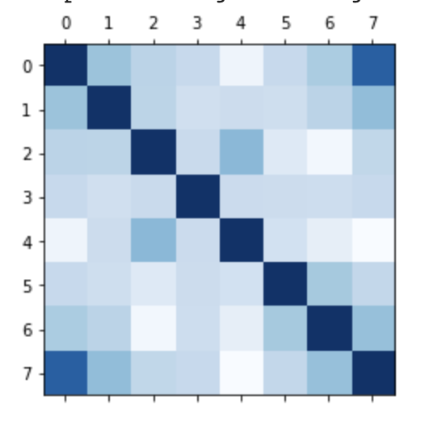
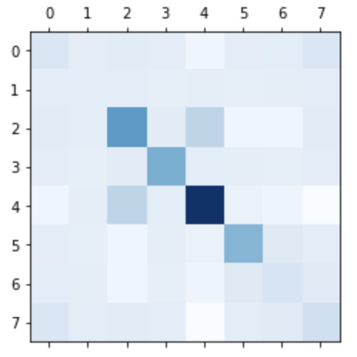
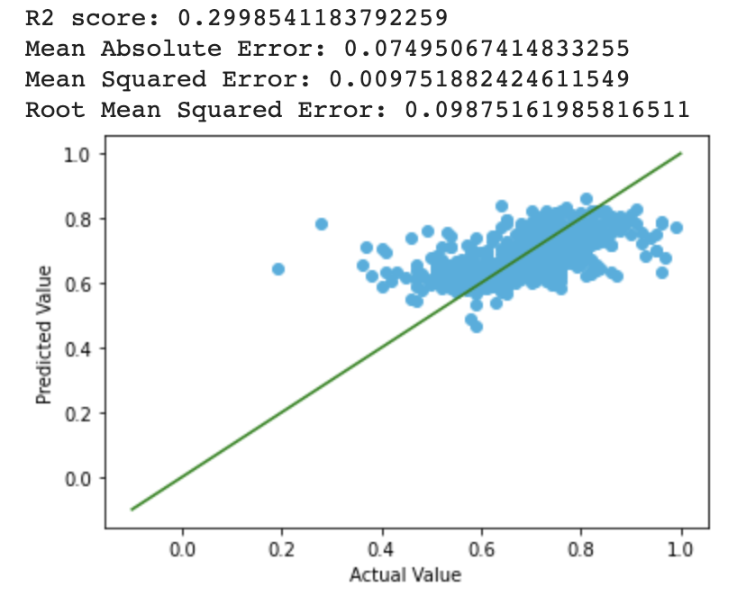
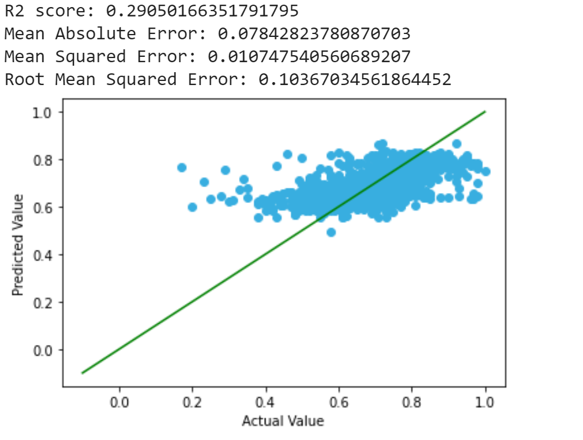
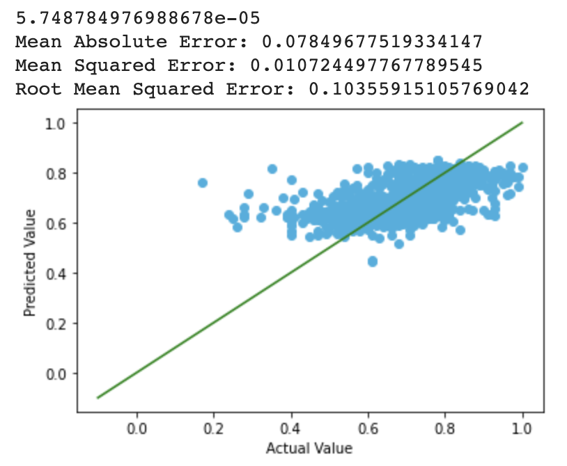
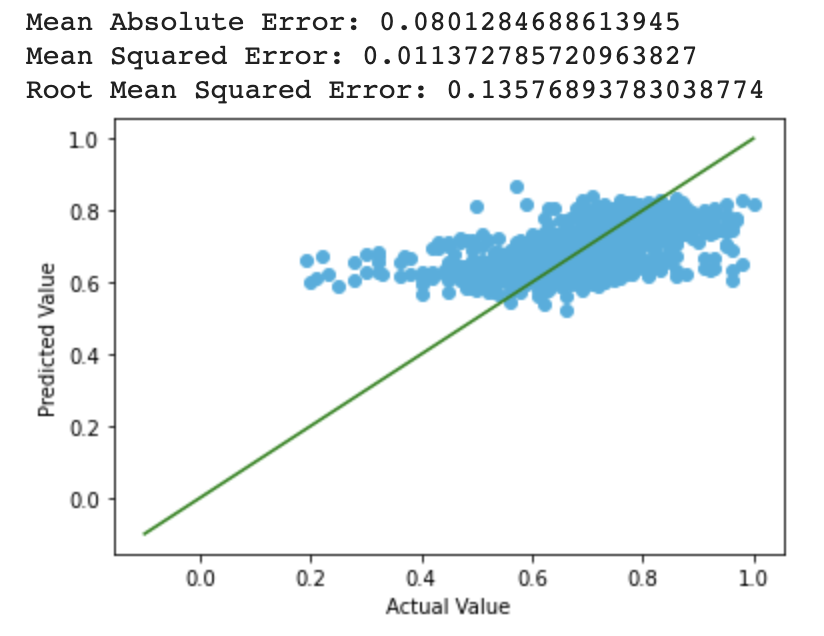
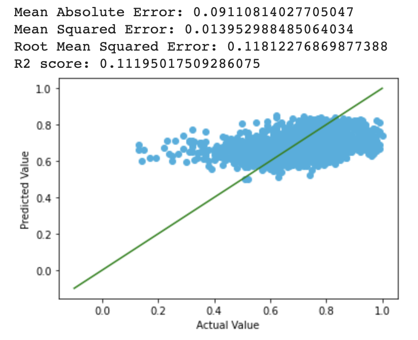
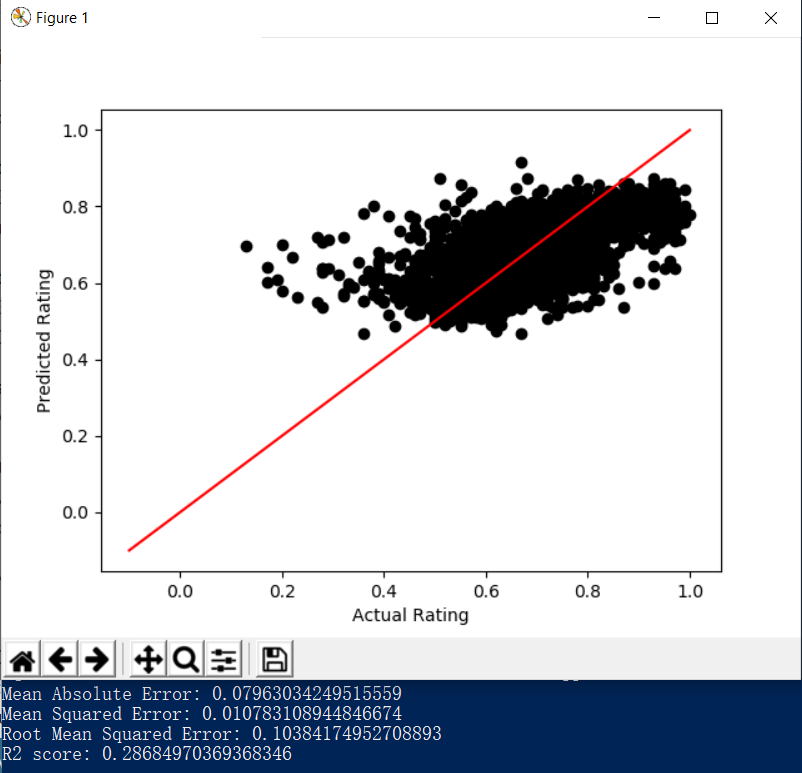

CS 4641 Spring 2020 Team 23  
Team members: Shaohua Shen, Zhou Lu, Jianing Fu, Sizhe Liu

# Motivation of Project

Throughout the past decade, video consumption has steadily shifted from traditional cable to online streaming platforms. Services like Netflix, Hulu, and HBO NOW are growing faster than anyone can expect. Even traditional tech companies like Amazon and Apple are trying to step into the tv industry by producing their own shows on their platforms like Amazon Prime Video and Apple TV+. Predictions state that the global online video streaming market size will reach USD 184.3 billion by 2027[1], and the key to success and gaining more subscriptions is to produce and stream good quality TV shows/moives. There is an increasing amount of interest in predicting a show’s quality on social media, but not a lot of research has been conducted using machine learning. Therefore, we deem it worthwhile to see how machine learning techniques, such as neural networks, can lead to better prediction for quality shows/movies.

# Dataset and Pre-Processing
Our source is from the IMDb Dataset[2] and the OMDb API[3]. We first pulled a list of every IMDb entry with their basic information including formats, title, releasing dates, length, etc. Within nearly 10 million entries, we filtered out all the entries that has less than 5000 counts of ratings since fewer number of rating might be bias so that cannot be a good measurement. We also filter out entires produced before year 2000 since the audience's taste would change with time.
Detailed information of the filtered dataset was pulled from the OMDb API, giving 10,489 entries.

## Dataset Features
There are x features in the dataset:
1. "title", title of the movie
2. "year", production year of the entry
3. "rated", parental guidance rating of the entry
4. "released", excat release date of the entry
5. "runtime", totalu runtime in minutes of the entry
6. "genre", genre of the entry
7. "director", director of the entry
8. "writer", writer of the entry
9. "actors", actors of the entry
10. "awards", awards won by the entry
11. "ratings", rating of the movie by other platforms
12. "metascore", rating by metacritic
13. "imdb_rating", rating by imdb users
14. "imdb_votes", number of the votes
15. "imdb_id", imdb id for the entryent
16. "type", type of the entry (movie/shows)
17. "dvd", release date of the DVD
18. "box_office", box office of the entry
19. "production", production company of the entry 
20. "website", website of the entry
21. "plot", plot of the entry
22. "poster", link to the poster of the entry
23. "language", language of the entry 
24. "country", country the entry was produced in 

This project is trying to predict the entry's "imdb_rating" by other given information.

## Dataset Visualization
## Data Pre-Processing
### Irrelevent Features
"Plot", "Poster", "Language", and "Country" was deleted from the dataset since it's hard to analysis or might be discriminative.
Features that are irrelvant to the analysis were also dropped including title, imdb_id, imdb_votes, box_office, website, release date, dvd.
ratings, metascore, and awards were dropped since the movies/shows that we are trying to predict would not have these information before they were aired.

### Feature Quantization 
We quatized features including "rated", "actors", "director", "writer", "runtime", "production" by calculating the mean imdb_rating of each category/person's work and normalized from 0 to 10.0.

### Feature Analysis
After quantize the features, we plot and visualized the correlation matrix and covariance matrix to show their relationships:  
The labels appears in order of "actors","genre", "director", "writer", "production", "rated", "runtime", "imdb_rating"  
**Correlation matrix:  
  
Covariance matrix:**  
  

### Feature Selection

# Methods
## Regression
### Linear Regression
We decided to make our first predictions with linear regression. We used regression tool from scikit-learn library to achieve this. Regression fits the situation well since it's simple and able to predict continuous values. We first attempted to use simple linear regression, but the results are not ideal, most of the predictions falls in range [0.6, 0.8], while the actual values vary largely, the restult is shown as below:
  
### Polynomial Regression
To improve our result, we then applied polynomial regression, to take the interaction between factors into consideration:
  
### Ridge & Lasso
Aside from simple regression we also tried adding regularization factors into the regression model:
#### Ridge

#### Lasso

We observed that the range of prediction lies in range [0.4, 0.9] after applying polynomial regression, which is a large improvement, but the results are still not optimal. One possible explanation is that most film ratings fall in the range of [4, 9], and it is unusual for a film to either not recieving any critical comment (>9), or recieving only critical comments (<4), and there might be factors that we did not take into consideration that could still affect the rating of the film.
## Neural Network
We also used neural network for prediction. Neural network is widely utilized in predictive analyzing problems that are similar with ours. Similar with regression, we used scikit learn tools to implement our nn model. To be more specific, we took use of the MLPRegressor class, which is a multi-layer perceptron regression system. It uses the square error as the loss function, and the output is a set of continuous values. For the parameters employed in our network, the activation function is Relu and optimization solver is Adam. Our learning rate is initially 0.0005 and constant during the time. The results we received from the model are shown below, including errors and R2 score:
  
The Root Mean Square Error was 0.118, and the R2 score was 0.112. We tried using different learning rates and optimization solvers. The best result we have in one run so far was below:
 
The neural network was not performing better than the linear regression model. Results from neural network are similar with those from Ridge and Lasso regression models.

# Conclusion
Throughout the project, we gathered over 990,000 entries and unsampled unpopluar and old entries which would not provided valid rating information for predicting today's market behavior. We decided to analysis over 10,000 movies/shows released after year 2000 and with over 5000 votes. 

# Reference

[1]“Video Streaming Market Worth $184.3 Billion By 2027: CAGR: 20.4%.” Market Research Reports & Consulting, www.grandviewresearch.com/press-release/global-video-streaming-market.

[2] https://www.imdb.com/interfaces/  https://datasets.imdbws.com/

[3] http://www.omdbapi.com/
